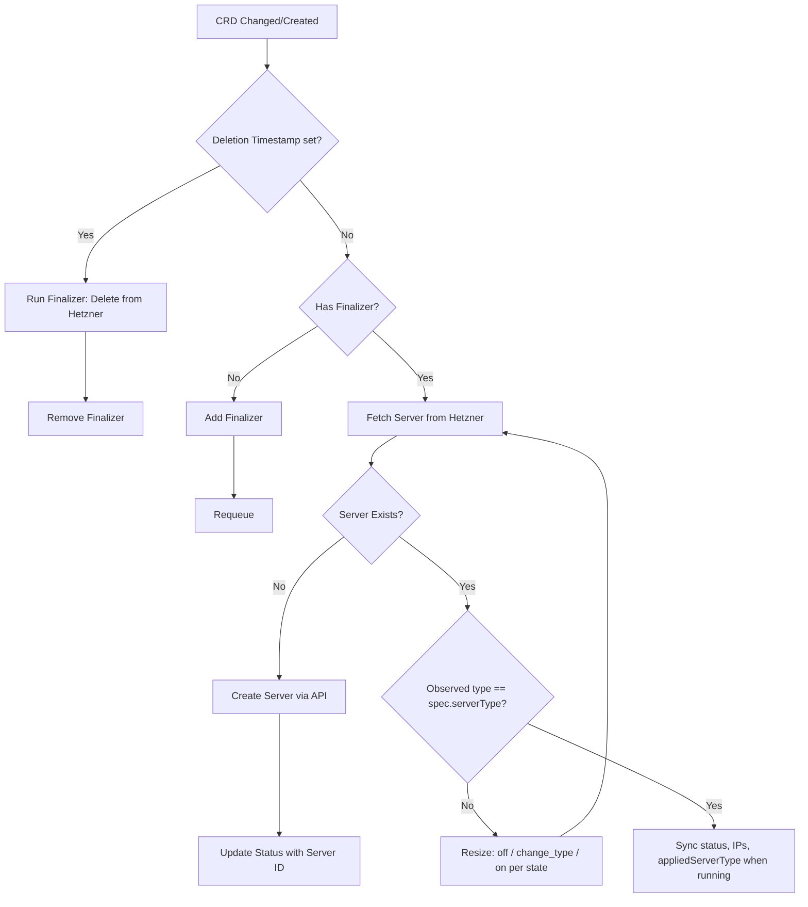

# HKIC Architecture

## Overview
Hetzner Kubernetes Infrastructure Controller (HKIC) is a Kubernetes-native operator that provisions and manages Hetzner Cloud infrastructure using the Operator pattern.

**Strategic direction:** **[ACK](https://aws.amazon.com/blogs/containers/aws-controllers-for-kubernetes-ack/)-style** coverage of the **Hetzner Cloud API** through composable CRDs and reconcilers—one resource kind per controller where it makes sense. Users adopt only what they need (servers-only, storage-only, full stacks, etc.). Optional samples (including k3s-on-Hetzner recipes) compose those primitives; they are not the product definition. See `docs/roadmap.md` and `docs/hcloud-api-coverage.md`.

## Components

1. **Custom Resource Definitions (CRDs)**
   - The API layer defined in Kubernetes.
   - Example: `HCloudServer` defines the desired state of a Hetzner Cloud VM.
   - Current surface includes `HCloudServer`, `HCloudVolume`, `HCloudLoadBalancer`, `HCloudNetwork`, `HCloudFirewall`, `HCloudPlacementGroup`, `HCloudPrimaryIP`, `HCloudFloatingIP`, and `HCloudCertificate` (see `docs/hcloud-api-coverage.md` for the full matrix).
   - Multiple CRDs compose into larger systems; none are mandatory unless you need that capability.

2. **Controller (Reconciler)**
   - Runs as a pod in the cluster.
   - Each major resource kind has its own reconciler (loosely coupled).
   - Watches for changes to the CRDs it owns, compares desired state against Hetzner Cloud, and updates status conditions/observed IDs.
   - Status writes use retry-on-conflict behavior to handle concurrent reconciles without noisy `object has been modified` failures.

3. **Hetzner Cloud Client Wrapper**
   - Thin wrapper around the official `hcloud-go` SDK.
   - Adds idempotency and Kubernetes-specific error handling.

## Reconciliation Loop (HCloudServer)

The reconciler creates or adopts a server, keeps `status` in sync, and implements **server type changes** when `spec.serverType` differs from Hetzner: wait until safe (`initializing` / `stopping` / `migrating` clear), **power off**, **`change_type`**, then **power on**. `status.appliedServerType` records the last fully converged type (spec matches API and state was `running`).

