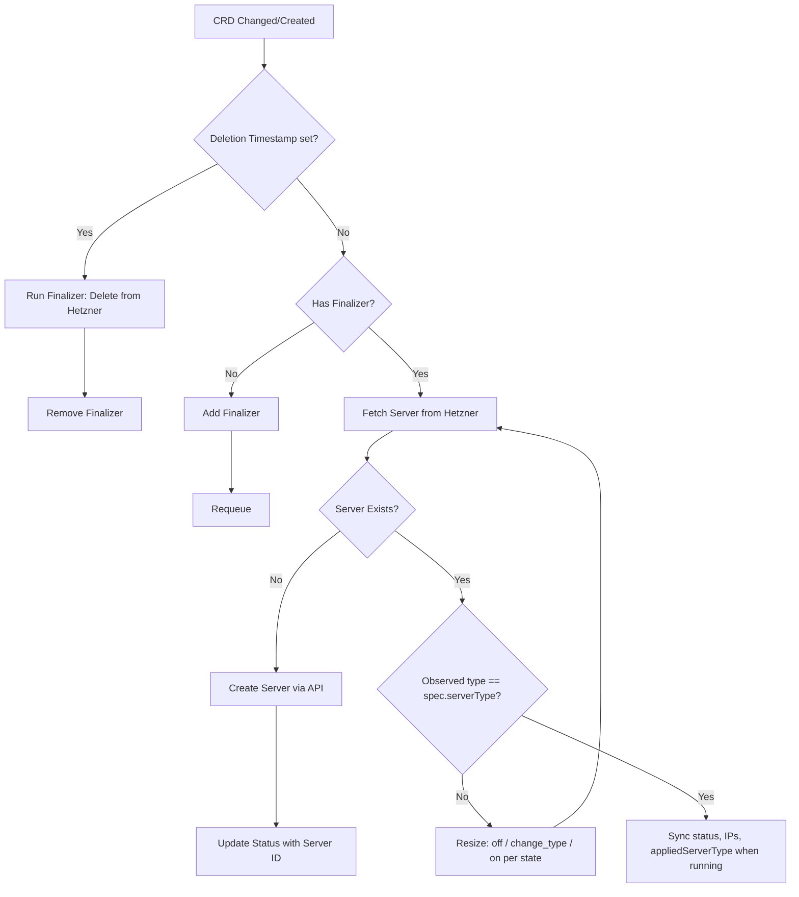

# HKIC Architecture

## Overview
Hetzner Kubernetes Infrastructure Controller (HKIC) is a Kubernetes-native operator that provisions and manages Hetzner Cloud infrastructure using the Operator pattern.

**Strategic direction:** converge on the same *class* of production **k3s** clusters that [hetzner-k3s](https://github.com/vitobotta/hetzner-k3s) provisions (private networking, node pools, security, load balancing, bootstrap, Day-2 components), expressed as CRDs and reconcilers rather than a standalone CLI. See `docs/roadmap.md` (milestone: hetzner-k3s parity).

## Components

1. **Custom Resource Definitions (CRDs)**
   - The API layer defined in Kubernetes.
   - Example: `HCloudServer` defines the desired state of a Hetzner Cloud VM.

2. **Controller (Reconciler)**
   - Runs as a pod in the cluster.
   - Watches for changes to `HCloudServer` resources.
   - Compares desired state (CRD spec) against actual state (Hetzner Cloud).

3. **Hetzner Cloud Client Wrapper**
   - Thin wrapper around the official `hcloud-go` SDK.
   - Adds idempotency and Kubernetes-specific error handling.

## Reconciliation Loop (HCloudServer)

The reconciler creates or adopts a server, keeps `status` in sync, and implements **server type changes** when `spec.serverType` differs from Hetzner: wait until safe (`initializing` / `stopping` / `migrating` clear), **power off**, **`change_type`**, then **power on**. `status.appliedServerType` records the last fully converged type (spec matches API and state was `running`).

