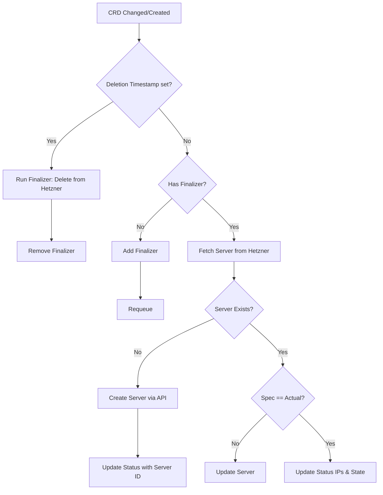

# HKIC Architecture

## Overview
Hetzner Kubernetes Infrastructure Controller (HKIC) is a Kubernetes-native operator that provisions and manages Hetzner Cloud infrastructure using the Operator pattern.

## Components

1. **Custom Resource Definitions (CRDs)**
   - The API layer defined in Kubernetes.
   - Example: `HCloudServer` defines the desired state of a Hetzner Cloud VM.

2. **Controller (Reconciler)**
   - Runs as a pod in the cluster.
   - Watches for changes to `HCloudServer` resources.
   - Compares desired state (CRD spec) against actual state (Hetzner Cloud).

3. **Hetzner Cloud Client Wrapper**
   - Thin wrapper around the official `hcloud-go` SDK.
   - Adds idempotency and Kubernetes-specific error handling.

## Reconciliation Loop (HCloudServer)

